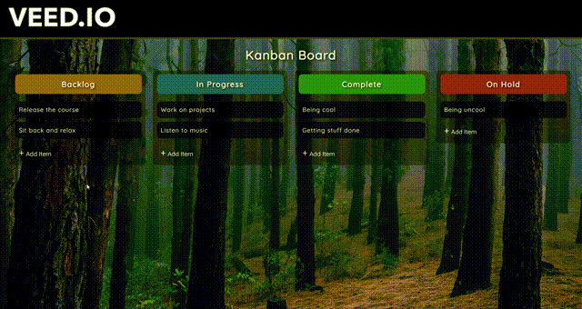
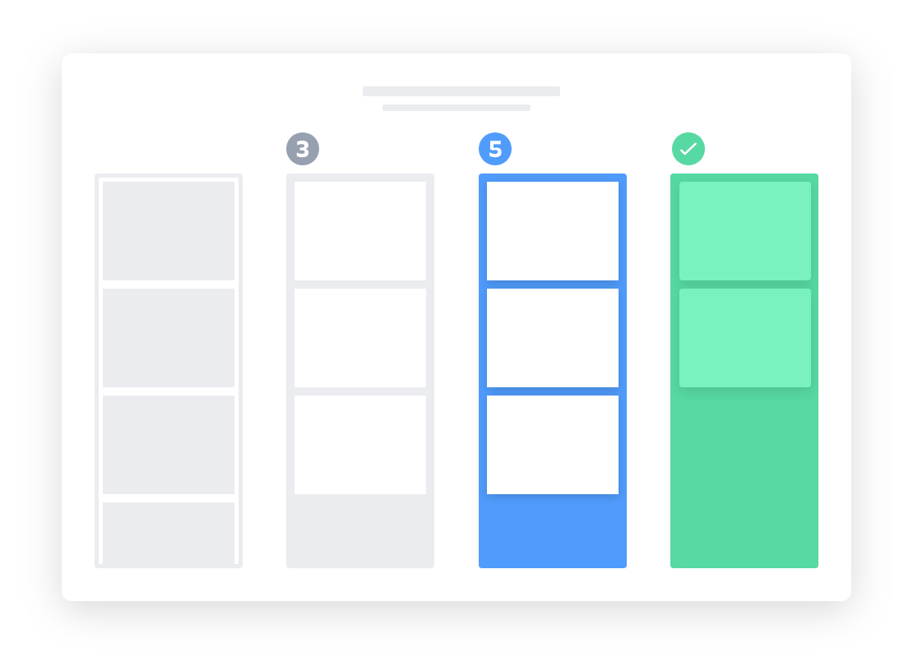

<!-- Improved compatibility of back to top link: See: https://github.com/othneildrew/Best-README-Template/pull/73 -->

<!--
*** Thanks for checking out the Best-README-Template. If you have a suggestion
*** that would make this better, please fork the repo and create a pull request
*** or simply open an issue with the tag "enhancement".
*** Don't forget to give the project a star!
*** Thanks again! Now go create something AMAZING! :D
-->

<!-- PROJECT SHIELDS -->
<!--
*** I'm using markdown "reference style" links for readability.
*** Reference links are enclosed in brackets [ ] instead of parentheses ( ).
*** See the bottom of this document for the declaration of the reference variables
*** for contributors-url, forks-url, etc. This is an optional, concise syntax you may use.
*** https://www.markdownguide.org/basic-syntax/#reference-style-links
-->
[![Contributors][contributors-shield]][contributors-url]
[![Forks][forks-shield]][forks-url]
[![Stargazers][stars-shield]][stars-url]
[![Issues][issues-shield]][issues-url]
[![MIT License][license-shield]][license-url]
[![LinkedIn][linkedin-shield]][linkedin-url]

<!-- PROJECT LOGO -->
 

  

<h3 align="center">Spock Rock Game</h3>

  

    A JavaScript based Spock Rock Game feat. Confetti.js, Modules
     
    <a href="https://github.com/Prasenjit-3433/Spock-Rock-Game"><strong>Explore the docs »</strong></a>
     
     
    <a href="https://spockrockjsgame.netlify.app/">View Demo</a>
    ·
    <a href="https://github.com/Prasenjit-3433/Spock-Rock-Game/issues">Report Bug</a>
    ·
    <a href="https://github.com/Prasenjit-3433/Spock-Rock-Game/issues">Request Feature</a>
  

<!-- TABLE OF CONTENTS -->

  
Table of Contents

  <ol>
    <li>
      <a href="#about-the-project">About The Project</a>
      <ul>
        <li><a href="#built-with">Tech Stack</a></li>
      </ul>
    </li>
    <li>
      <a href="#getting-started">Getting Started</a>
      <ul>
        <li><a href="#prerequisites">Prerequisites</a></li>
        <li><a href="#installation">Installation</a></li>
      </ul>
    </li>
    <li><a href="#implementation">Implementation</a></li>
    <li><a href="#contributing">Contributing</a></li>
    <li><a href="#license">License</a></li>
    <li><a href="#contact">Contact</a></li>
    <li><a href="#acknowledgments">Acknowledgments</a></li>
  </ol>

<!-- ABOUT THE PROJECT -->
## 🙋 About The Project

<!--   -->

  

"Kanban" is the Japanese word for "visual signal". If you work in services or technology, your work is often times invisible and intangible. A kanban board is an agile project management tool designed to help visualize work, limit work-in-progress, and maximize efficiency (or flow). It can help both `agile` and `DevOps` teams establish order in their daily work. Kanban boards use cards, columns, and continuous improvement to help technology and service teams commit to the right amount of work, and get it done!

Kanban has come a long way from its origins in lean manufacturing thanks to a small but mighty group of kanban enthusiasts. David Anderson’s work defining the kanban method helped bring kanban into the software and services space, and Personal Kanban, by Jim Benson and Tonianne DeMaria, helped expand the applications of kanban to places you wouldn’t believe. 🔥

(<a href="#readme-top">back to top</a>)

### 🛠 Built With

* 
* 
* 

(<a href="#readme-top">back to top</a>)

<!-- GETTING STARTED -->
## 🚀 Getting Started

This is an example of how you may start on setting up your project locally.
To get a local copy up and running follow these simple example steps.

### Prerequisites

This is an example of how to list things you need to use the software and how to install them.
* Live Server Extension
  

### Installation

1. First of all install `Live Server` extension by `Ritwick Dey`.
2. Once the extension was installed, then `right-click` on `index.html` and select `Open with Live Server`.
3. It'll open a new tab in browser & start serving the game. Enjoy!.

(<a href="#readme-top">back to top</a>)

<!-- USAGE EXAMPLES -->
## 🏗️ Implementation

* First of all, we need to gather all `functional requirements` of the Kanban Board. kanban boards can be broken down into five components: `Visual signals`, `columns`, `work-in-progress` limits, a `commitment point`, and a `delivery point`.

 

  
More About Each Component

  <ol>
    <li>
      
Visual Signals — One of the first things you’ll notice about a kanban board are the visual cards (stickies, tickets, or otherwise). Kanban teams write all of their projects and work items onto cards, usually one per card. For agile teams, each card could encapsulate one user story. Once on the board, these visual signals help teammates and stakeholders quickly understand what the team is working on.

    </li>
    <li>
      
Columns — Another hallmark of the kanban board are the columns. Each column represents a specific activity that together compose a “workflow”. Cards flow through the workflow until completion. Workflows can be as simple as “To Do,” “In Progress,” “Complete,” or much more complex.

    </li>
    <li>
      
Work In Progress (WIP) Limits — WIP limits are the maximum number of cards that can be in one column at any given time. A column with a WIP limit of three cannot have more than three cards in it. When the column is “maxed-out” the team needs to swarm on those cards and move them forward before new cards can move into that stage of the workflow. These WIP limits are critical for exposing bottlenecks in the workflow and maximizing flow. WIP limits give you an early warning sign that you committed to too much work.

    </li>
    <li>
      
Commitment point — Kanban teams often have a backlog for their board. This is where customers and teammates put ideas for projects that the team can pick up when they are ready. The commitment point is the moment when an idea is picked up by the team and work starts on the projec

    </li>
    <li>
      
Delivery point — The delivery point is the end of a kanban team’s workflow. For most teams, the delivery point is when the product or service is in the hands of the customer. The team’s goal is to take cards from the commitment point to the delivery point as fast as possible. The elapsed time between the two is the called Lead Time. Kanban teams are continuously improving to decrease their lead time as much as possible.

    </li>
  </ol>

* Then break the whole board into small `Ui Components` & start building indivisual components.

Ui Components:

<ol>
<li>
    

      
Columns, Custom Scrollbar

      <ul>
        <li>an unordered list is going to hold these 4 columns & each column is going to contain another unordered list which'll hold all the task items.</li>
        <li>In each column, there'll be a header at top that indicates the type of the column, followed by task items and then at last, two buttons - add-item, save-item and a textbar which'll be hidden by default.</li>
        <li>Each task item can have a maximum height of 52% of viewport height, so that user can always sees the bottom of the column. </li>
        <li>If a column contains any task item with very long text, then in that case, a custom-designed scollbar will appear at side to scroll through the task items and at same item user can see whole column.</li>
        <li>Each section'll contain "player-name" followed by "score" and then "name-of-the-choice" the player selects. </li>
        <li>Next, all the "move-icons" sits in line.</li>
      </ul>
    

  </li>
  </li>
  <li>
    

      
Player's Move Icon

      <ul>
        <li>For user's selection, when user click on an icon, it's color turns into black & updates the "name-of-the-choice" portion from "choice" (by-default) to the selected one.</li>
        <li>For computer's choice, generate a number between 0 & 1 and divided whole (0, 1) interval into 5 parts - each of width 0.2. According as where does the generated number lie, we assign one from 'rock', 'paper', 'scissors', 'lizard', 'spock' respectively.</li>
        <li>Once computer chooses it's move, the respected icon's color on the game board turns into black & updates the "name-of-the-choice" portion from "choice" (by-default) to the selected one.</li>
        <li></li>
      </ul>
    

    </li>
  <li>
    

      
Determining Winner

      <ul>
        <li>First of all, it's very crucial to choose a right data structure to hold choices:</li>
        <li></li>
        <li>Corresponding to the player's choice, if defeats array inside of that choice contains Computer's choice, then player wins. Otherwise Computer wins.</li>
        <li>Finally, update the score of both player & computer in the game board.</li>
      </ul>
    

  </li>
  <li>
  

      
Confetti falling animation over Win

    <ul>
        <li>Here we used confetti.js, a vanilla JS library for creating a configurable, high-performance confetti falling animation using HTML5 canvas and requestAnimFrame API.</li>
        <li>The confetti.js is modified little bit to bring the code under anonymous function into global scope. So that these three functions: 'startConfetti', 'stopConfetti', 'removeConfetti' become globally available.</li>
        <li>The good news is that modern browsers have started to support module functionality natively. This can only be a good thing — browsers can optimize loading of modules, making it more efficient than having to use a library and do all of that extra client-side processing and extra round trips.</li>
        <li>In order to do that, firstly we have to export the above three specified functions & import them inside main script file. Then execute main script file as the top-level module: </li>
        <li></li>
        <li>But type="module" makes main script self-contained. That means the main script no longer shares in global scope with the elements in index.html</li>
        <li>To make things globally available, pass it into Window object like this: </li>
        <li></li>
      </ul>
    

  </li>
</ol>

_To see in action, please visit to the [Link](https://spockrockjsgame.netlify.app/)_

(<a href="#readme-top">back to top</a>)

<!-- CONTRIBUTING -->
## 🤝 Contributing

Contributions are what make the open source community such an amazing place to learn, inspire, and create. Any contributions you make are **greatly appreciated**.

If you have a suggestion that would make this better, please fork the repo and create a pull request. You can also simply open an issue with the tag "enhancement".
Don't forget to give the project a star! Thanks again!

1. Fork the Project
2. Create your Feature Branch (`git checkout -b feature/AmazingFeature`)
3. Commit your Changes (`git commit -m 'Add some AmazingFeature'`)
4. Push to the Branch (`git push origin feature/AmazingFeature`)
5. Open a Pull Request

(<a href="#readme-top">back to top</a>)

<!-- LICENSE -->
## 📜 License

Distributed under the MIT License. See `LICENSE.txt` for more information.

(<a href="#readme-top">back to top</a>)

<!-- CONTACT -->
## 📮 Contact

Prasenjit Sutradhar - [@twitter_handle](https://twitter.com/twitter_handle) - prasenjitsutradhar3433@gmail.com

Project Link: [https://github.com/Prasenjit-3433/Spock-Rock-Game](https://github.com/Prasenjit-3433/Spock-Rock-Game)

(<a href="#readme-top">back to top</a>)

<!-- ACKNOWLEDGMENTS -->
## ✌️ Acknowledgments

* 
* 
* 

(<a href="#readme-top">back to top</a>)

<!-- MARKDOWN LINKS & IMAGES -->
<!-- https://www.markdownguide.org/basic-syntax/#reference-style-links -->
[contributors-shield]: https://img.shields.io/github/contributors/Prasenjit-3433/Spock-Rock-Game.svg?style=for-the-badge
[contributors-url]: https://github.com/Prasenjit-3433/Spock-Rock-Game/graphs/contributors
[forks-shield]: https://img.shields.io/github/forks/Prasenjit-3433/Spock-Rock-Game.svg?style=for-the-badge
[forks-url]: https://github.com/Prasenjit-3433/Spock-Rock-Game/network/members
[stars-shield]: https://img.shields.io/github/stars/Prasenjit-3433/Spock-Rock-Game.svg?style=for-the-badge
[stars-url]: https://github.com/Prasenjit-3433/Spock-Rock-Game/stargazers
[issues-shield]: https://img.shields.io/github/issues/Prasenjit-3433/Spock-Rock-Game.svg?style=for-the-badge
[issues-url]: https://github.com/Prasenjit-3433/Spock-Rock-Game/issues
[license-shield]: https://img.shields.io/github/license/Prasenjit-3433/Spock-Rock-Game.svg?style=for-the-badge
[license-url]: https://github.com/Prasenjit-3433/Spock-Rock-Game/blob/main/LICENSE.txt
[linkedin-shield]: https://img.shields.io/badge/-LinkedIn-black.svg?style=for-the-badge&logo=linkedin&colorB=555
[linkedin-url]: https://in.linkedin.com/
[product-screenshot]: images/screenshot.png
[HTML5]: https://img.shields.io/badge/HTML5-f06529?style=for-the-badge&logo=html5&logoColor=white
[HTML-url]: https://developer.mozilla.org/en-US/docs/Glossary/HTML5
[Css]: https://img.shields.io/badge/CSS3-2965f1?style=for-the-badge&logo=CSS3&logoColor=white
[Css-url]: https://developer.mozilla.org/en-US/docs/Web/CSS
[Js]: https://img.shields.io/badge/JavaScript-F0DB4F?style=for-the-badge&logo=JavaScript&logoColor=323330
[Js-url]: https://www.javascript.com/
